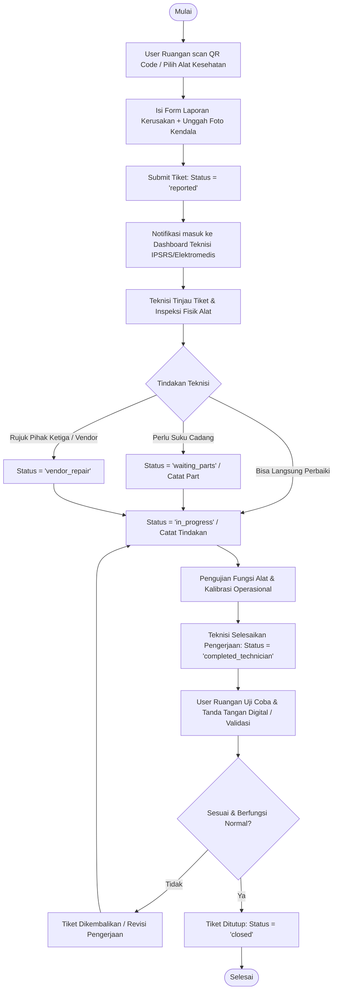
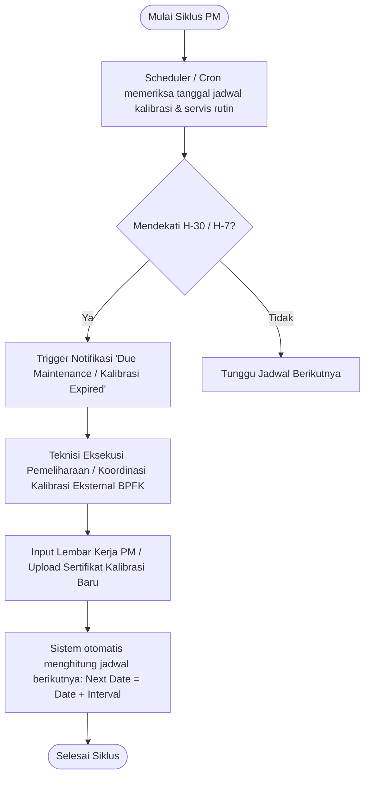
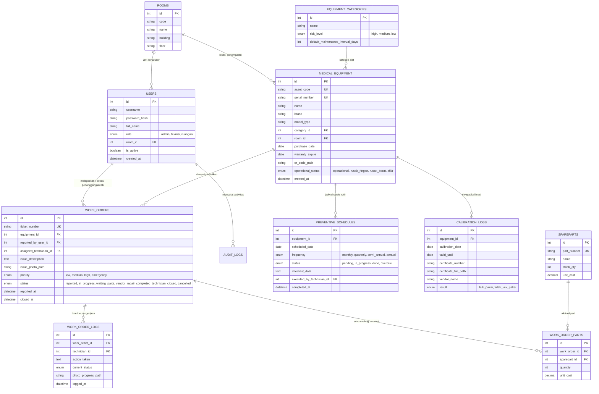

# Blueprint Arsitektur Sistem Informasi Pemeliharaan Alat Kesehatan (SIMPELKES)
**Stack**: CodeIgniter 3 (REST API Backend) + Vue.js (Frontend SPA/Vite)  
**Database**: MySQL / MariaDB  
**PHP Version**: PHP 7.4.22 (cli) (built: Jul 28 2021 09:44:30) ( ZTS Visual C++ 2017 x64 )
**IDE Target**: Antigravity IDE  
**Database Connection URL**: C:\\Program Files\\MariaDB 10.4\\bin -uroot -pbismillah
**Kerangka Backend** : C:\\xampp\\htdocs\\simpelkesrsig-backend
**Hasil Build Frontend**: Nanti copy ke xampp\htdocs\simpelkesrsig. note: sekalian buatkan .htaccess nya juga di folder simpelkesrsig agar bisa berjalan normal di xampp 

---

## 1. Flowchart & Business Process

### 1.1 Alur Corrective Maintenance (Pelaporan & Perbaikan Kerusakan)



### 1.2 Alur Preventive Maintenance & Kalibrasi Berkala



---

## 2. Entity Relationship Diagram (ERD)

### 2.1 Diagram Hubungan Entitas (Mermaid ERD)



---

## 3. Skema Database DDL (MySQL Ready)

```sql
-- Buat Tabel Rooms
CREATE TABLE IF NOT EXISTS rooms (
    id INT AUTO_INCREMENT PRIMARY KEY,
    code VARCHAR(50) NOT NULL UNIQUE,
    name VARCHAR(150) NOT NULL,
    building VARCHAR(100) NULL,
    floor VARCHAR(20) NULL,
    created_at TIMESTAMP DEFAULT CURRENT_TIMESTAMP
) ENGINE=InnoDB DEFAULT CHARSET=utf8mb4;

-- Buat Tabel Users
CREATE TABLE IF NOT EXISTS users (
    id INT AUTO_INCREMENT PRIMARY KEY,
    username VARCHAR(80) NOT NULL UNIQUE,
    password_hash VARCHAR(255) NOT NULL,
    full_name VARCHAR(150) NOT NULL,
    role ENUM('admin', 'teknisi', 'ruangan') NOT NULL DEFAULT 'ruangan',
    room_id INT NULL,
    is_active TINYINT(1) DEFAULT 1,
    created_at TIMESTAMP DEFAULT CURRENT_TIMESTAMP,
    CONSTRAINT fk_users_room FOREIGN KEY (room_id) REFERENCES rooms(id) ON DELETE SET NULL
) ENGINE=InnoDB DEFAULT CHARSET=utf8mb4;

-- Kategori Alat Medis
CREATE TABLE IF NOT EXISTS equipment_categories (
    id INT AUTO_INCREMENT PRIMARY KEY,
    name VARCHAR(100) NOT NULL,
    risk_level ENUM('high', 'medium', 'low') DEFAULT 'medium',
    default_maintenance_interval_days INT DEFAULT 90,
    created_at TIMESTAMP DEFAULT CURRENT_TIMESTAMP
) ENGINE=InnoDB DEFAULT CHARSET=utf8mb4;

-- Master Alat Medis
CREATE TABLE IF NOT EXISTS medical_equipment (
    id INT AUTO_INCREMENT PRIMARY KEY,
    asset_code VARCHAR(100) NOT NULL UNIQUE,
    serial_number VARCHAR(100) NOT NULL,
    name VARCHAR(200) NOT NULL,
    brand VARCHAR(100) NULL,
    model_type VARCHAR(100) NULL,
    category_id INT NOT NULL,
    room_id INT NOT NULL,
    purchase_date DATE NULL,
    warranty_expire DATE NULL,
    qr_code_path VARCHAR(255) NULL,
    operational_status ENUM('operasional', 'rusak_ringan', 'rusak_berat', 'afkir') DEFAULT 'operasional',
    created_at TIMESTAMP DEFAULT CURRENT_TIMESTAMP,
    updated_at TIMESTAMP DEFAULT CURRENT_TIMESTAMP ON UPDATE CURRENT_TIMESTAMP,
    CONSTRAINT fk_eq_category FOREIGN KEY (category_id) REFERENCES equipment_categories(id),
    CONSTRAINT fk_eq_room FOREIGN KEY (room_id) REFERENCES rooms(id)
) ENGINE=InnoDB DEFAULT CHARSET=utf8mb4;

-- Tiket Servis / Work Orders (Corrective)
CREATE TABLE IF NOT EXISTS work_orders (
    id INT AUTO_INCREMENT PRIMARY KEY,
    ticket_number VARCHAR(60) NOT NULL UNIQUE,
    equipment_id INT NOT NULL,
    reported_by_user_id INT NOT NULL,
    assigned_technician_id INT NULL,
    issue_description TEXT NOT NULL,
    issue_photo_path VARCHAR(255) NULL,
    priority ENUM('low', 'medium', 'high', 'emergency') DEFAULT 'medium',
    status ENUM('reported', 'in_progress', 'waiting_parts', 'vendor_repair', 'completed_technician', 'closed', 'cancelled') DEFAULT 'reported',
    reported_at DATETIME DEFAULT CURRENT_TIMESTAMP,
    closed_at DATETIME NULL,
    CONSTRAINT fk_wo_equipment FOREIGN KEY (equipment_id) REFERENCES medical_equipment(id),
    CONSTRAINT fk_wo_reporter FOREIGN KEY (reported_by_user_id) REFERENCES users(id),
    CONSTRAINT fk_wo_technician FOREIGN KEY (assigned_technician_id) REFERENCES users(id)
) ENGINE=InnoDB DEFAULT CHARSET=utf8mb4;

-- Catatan Tracking Tindakan Teknisi
CREATE TABLE IF NOT EXISTS work_order_logs (
    id INT AUTO_INCREMENT PRIMARY KEY,
    work_order_id INT NOT NULL,
    technician_id INT NOT NULL,
    action_taken TEXT NOT NULL,
    current_status VARCHAR(50) NOT NULL,
    photo_progress_path VARCHAR(255) NULL,
    logged_at DATETIME DEFAULT CURRENT_TIMESTAMP,
    CONSTRAINT fk_wolog_wo FOREIGN KEY (work_order_id) REFERENCES work_orders(id) ON DELETE CASCADE,
    CONSTRAINT fk_wolog_tech FOREIGN KEY (technician_id) REFERENCES users(id)
) ENGINE=InnoDB DEFAULT CHARSET=utf8mb4;

-- Suku Cadang
CREATE TABLE IF NOT EXISTS spareparts (
    id INT AUTO_INCREMENT PRIMARY KEY,
    part_number VARCHAR(100) NOT NULL UNIQUE,
    name VARCHAR(150) NOT NULL,
    stock_qty INT DEFAULT 0,
    unit_cost DECIMAL(14,2) DEFAULT 0.00
) ENGINE=InnoDB DEFAULT CHARSET=utf8mb4;

CREATE TABLE IF NOT EXISTS work_order_parts (
    id INT AUTO_INCREMENT PRIMARY KEY,
    work_order_id INT NOT NULL,
    sparepart_id INT NOT NULL,
    quantity INT NOT NULL DEFAULT 1,
    unit_cost DECIMAL(14,2) NOT NULL DEFAULT 0.00,
    CONSTRAINT fk_wop_wo FOREIGN KEY (work_order_id) REFERENCES work_orders(id) ON DELETE CASCADE,
    CONSTRAINT fk_wop_part FOREIGN KEY (sparepart_id) REFERENCES spareparts(id)
) ENGINE=InnoDB DEFAULT CHARSET=utf8mb4;

-- Jadwal Pemeliharaan Preventif
CREATE TABLE IF NOT EXISTS preventive_schedules (
    id INT AUTO_INCREMENT PRIMARY KEY,
    equipment_id INT NOT NULL,
    scheduled_date DATE NOT NULL,
    frequency ENUM('monthly', 'quarterly', 'semi_annual', 'annual') DEFAULT 'quarterly',
    status ENUM('pending', 'in_progress', 'done', 'overdue') DEFAULT 'pending',
    checklist_data JSON NULL,
    executed_by_technician_id INT NULL,
    completed_at DATETIME NULL,
    CONSTRAINT fk_prev_eq FOREIGN KEY (equipment_id) REFERENCES medical_equipment(id),
    CONSTRAINT fk_prev_tech FOREIGN KEY (executed_by_technician_id) REFERENCES users(id)
) ENGINE=InnoDB DEFAULT CHARSET=utf8mb4;

-- Kalibrasi & Sertifikasi Alat
CREATE TABLE IF NOT EXISTS calibration_logs (
    id INT AUTO_INCREMENT PRIMARY KEY,
    equipment_id INT NOT NULL,
    calibration_date DATE NOT NULL,
    valid_until DATE NOT NULL,
    certificate_number VARCHAR(100) NOT NULL,
    certificate_file_path VARCHAR(255) NULL,
    vendor_name VARCHAR(150) NOT NULL,
    result ENUM('laik_pakai', 'tidak_laik_pakai') DEFAULT 'laik_pakai',
    created_at TIMESTAMP DEFAULT CURRENT_TIMESTAMP,
    CONSTRAINT fk_calib_eq FOREIGN KEY (equipment_id) REFERENCES medical_equipment(id)
) ENGINE=InnoDB DEFAULT CHARSET=utf8mb4;
```

---

## 4. Struktur Folder & Desain Proyek

```text
simpelkes-app/
├── backend/                  # CodeIgniter 3 Core
│   ├── application/
│   │   ├── config/
│   │   │   ├── config.php    # Base URL & CSRF Token config
│   │   │   ├── database.php  # Database connection
│   │   │   ├── routes.php    # API endpoints route
│   │   │   └── jwt.php       # Secret key JWT
│   │   ├── controllers/
│   │   │   └── api/
│   │   │       ├── Auth.php           # Login, Refresh, Profile
│   │   │       ├── Equipment.php      # CRUD Alat, QR Generator
│   │   │       ├── WorkOrders.php     # CRUD Tiket, Progress Teknisi
│   │   │       ├── Preventive.php     # Jadwal & Checklist PM
│   │   │       ├── Calibrations.php   # Sertifikat & Masa Berlaku
│   │   │       └── Dashboard.php      # MTTR, MTBF, Ketersediaan Alat
│   │   ├── libraries/
│   │   │   └── JWT.php                # Library Token Auth
│   │   └── models/
│   │       ├── User_model.php
│   │       ├── Equipment_model.php
│   │       ├── Work_order_model.php
│   │       └── Calibration_model.php
│   └── index.php
│
└── frontend/                 # Vue 3 SPA (Vite + Pinia + Vue Router + TailwindCSS)
    ├── src/
    │   ├── api/              # Axios Instance & Interceptors
    │   │   └── axiosClient.js
    │   ├── components/       # Reusable components
    │   │   ├── Navbar.vue
    │   │   ├── Sidebar.vue
    │   │   ├── QRScannerModal.vue
    │   │   └── StatusBadge.vue
    │   ├── router/
    │   │   └── index.js      # Navigation Guards (RBAC)
    │   ├── stores/
    │   │   └── authStore.js  # Pinia State
    │   └── views/
    │       ├── LoginView.vue
    │       ├── DashboardView.vue
    │       ├── equipment/
    │       │   ├── EquipmentListView.vue
    │       │   └── EquipmentDetailView.vue
    │       ├── tickets/
    │       │   ├── CreateTicketView.vue
    │       │   ├── TicketListView.vue
    │       │   └── TicketDetailView.vue
    │       └── maintenance/
    │           ├── PreventiveView.vue
    │           └── CalibrationView.vue
    ├── package.json
    └── vite.config.js
```

---

## 5. API Endpoints Reference (CodeIgniter 3 JSON Output)

| HTTP Method | Endpoint URI | Role Akses | Deskripsi |
| :--- | :--- | :--- | :--- |
| `POST` | `/api/auth/login` | Publik | Autentikasi user & mengembalikan Bearer JWT token |
| `GET` | `/api/equipment` | Semua Role | List data alat dengan filter ruangan & status |
| `GET` | `/api/equipment/{id}` | Semua Role | Detail spesifikasi, riwayat perbaikan & kalibrasi |
| `POST` | `/api/equipment` | Admin | Registrasi alat baru & auto-generate barcode/QR |
| `POST` | `/api/work-orders` | Ruangan, Admin | Melaporkan tiket kerusakan baru |
| `GET` | `/api/work-orders` | Semua Role | Daftar tiket (difilter per unit kerja jika user ruangan) |
| `PUT` | `/api/work-orders/{id}/assign`| Admin/Teknisi | Disposisi tiket ke teknisi tertentu |
| `POST` | `/api/work-orders/{id}/progress`| Teknisi | Update tindakan, progres pengerjaan, ganti sparepart |
| `PUT` | `/api/work-orders/{id}/close` | Ruangan, Admin | Konfirmasi alat sudah selesai dan tutup tiket |
| `GET` | `/api/preventive/schedules` | Teknisi, Admin | Jadwal pemeliharaan berkala |
| `GET` | `/api/calibrations/expiring` | Teknisi, Admin | Daftar alat yang masa kalibrasinya mendekati kedaluwarsa |
| `GET` | `/api/dashboard/summary` | Admin, Teknisi | Statistik MTTR, MTBF, persentase alat operasional |

---

## 6. Antigravity IDE Setup & Step-by-Step Execution Guide

### Langkah 1: Siapkan Database di Antigravity
### lokasi mysql saya C:\Program Files\MariaDB 10.4\bin -uroot -pbismillah
1. Buka terminal internal Antigravity IDE atau MySQL Client.
2. Database sudah saya create manual dengan nama simpelkesrsig, kamu tinggal ekseskusi selanjutnya
   
3. Eksekusi seluruh script DDL pada **Bagian 3** di atas.

### Langkah 2: Konfigurasi Backend (CodeIgniter 3)
1. Buka folder `backend/application/config/database.php`:
   ```php
   'hostname' => 'localhost',
   'username' => 'root',
   'password' => 'bismillah',
   'database' => 'simpelkesrsig',
   'dbdriver' => 'mysqli',
   ```
2. Set CORS Headers di `backend/application/config/config.php` atau hook agar Vue.js dapat mengakses API tanpa terkendala CORS:
   ```php
   header('Access-Control-Allow-Origin: *');
   header('Access-Control-Allow-Headers: X-API-KEY, Origin, X-Requested-With, Content-Type, Accept, Access-Control-Request-Method, Authorization');
   header('Access-Control-Allow-Methods: GET, POST, OPTIONS, PUT, DELETE');
   ```

### Langkah 3: Jalankan Backend & Frontend di Terminal Antigravity IDE
* **Terminal 1 (Backend CI3):**
  ```bash
  cd backend
  php -S localhost:8000
  ```
* **Terminal 2 (Frontend Vue.js):**
  ```bash
  cd frontend
  npm install
  npm run dev
  ```
Aplikasi web siap diakses dan dikembangkan langsung via Antigravity IDE.
